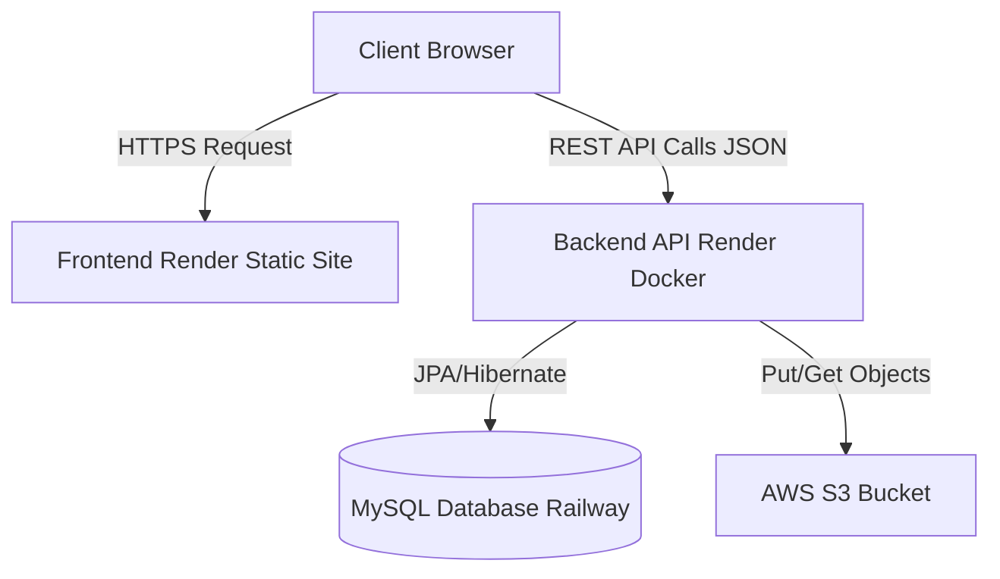
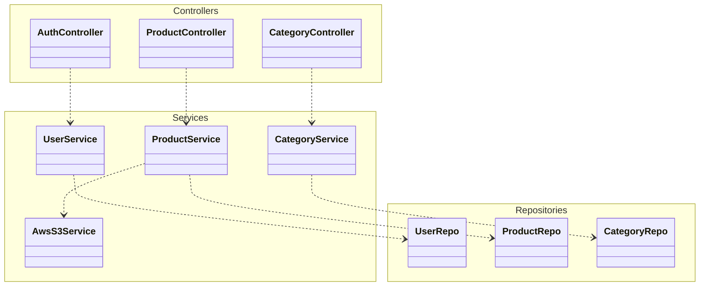
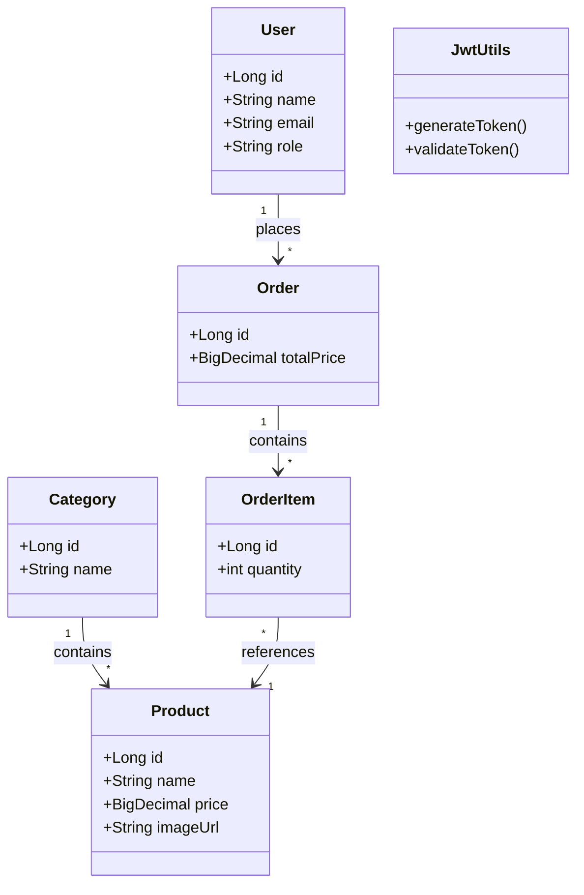
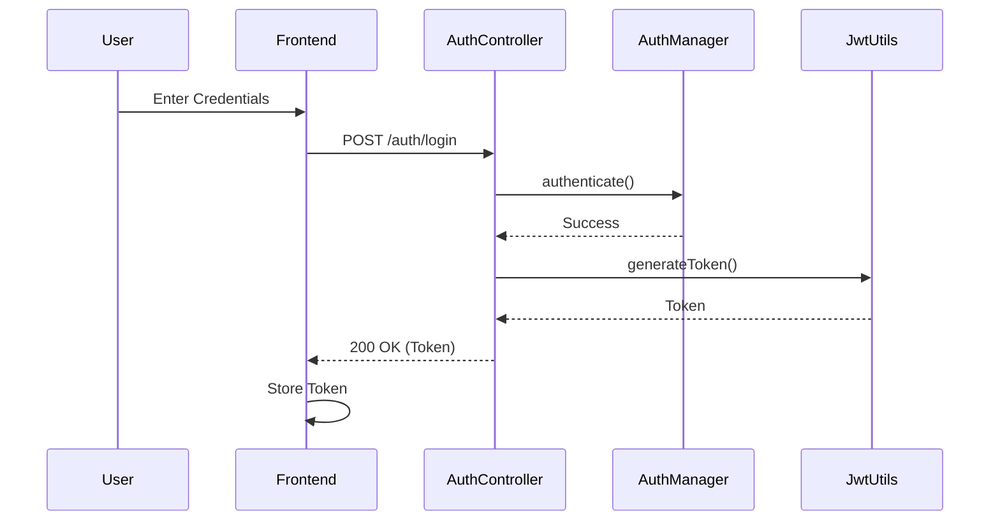
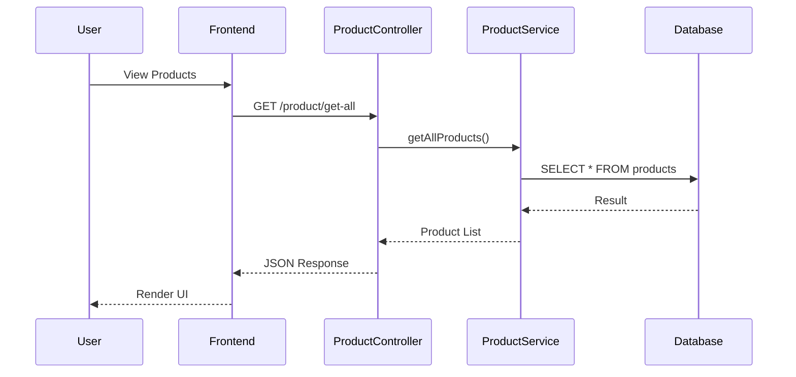
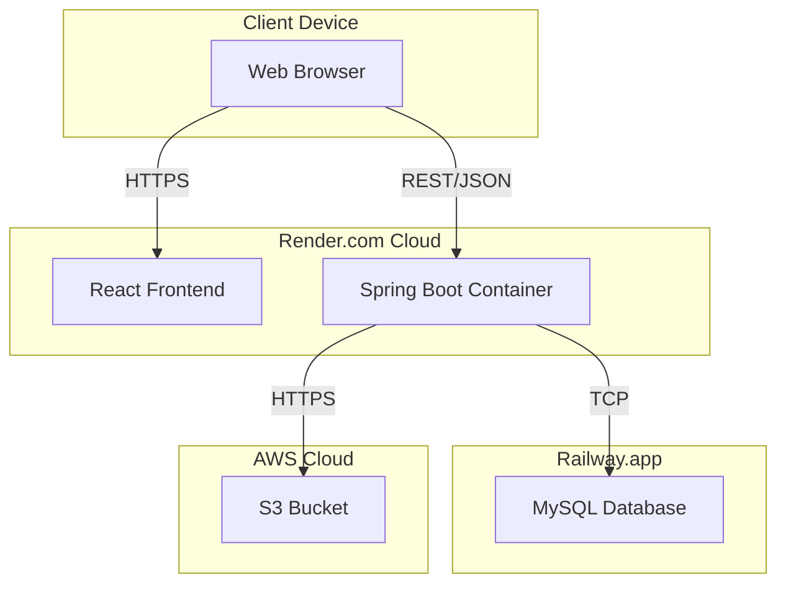

# System Architecture Documentation

## 1. High-Level System Architecture
This diagram illustrates the overall data flow from the client (Browser) to the backend services, database, and external storage.

## 2. Backend Component Diagram
Breakdown of the Spring Boot Backend architecture showing the layered approach.

## 3. Class Diagram
Core Entities and Security Classes.

## 4. Sequence Diagrams

### 4.1 User Login Flow

### 4.2 Product Fetch Request

## 5. Deployment Diagram
Physical deployment architecture.

